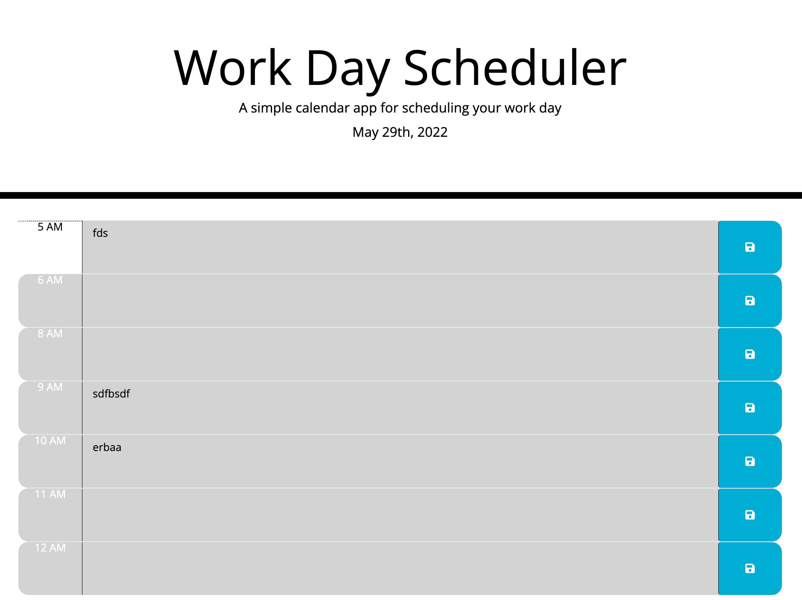

# ch5w5
our Task
Create a simple calendar application that allows a user to save events for each hour of the day by modifying starter code. This app will run in the browser and feature dynamically updated HTML and CSS powered by jQuery.

You'll need to use the Moment.js library to work with date and time. Be sure to read the documentation carefully and concentrate on using Moment.js in the browser.

User Story
AS AN employee with a busy schedule
I WANT to add important events to a daily planner
SO THAT I can manage my time effectively
Acceptance Criteria
GIVEN I am using a daily planner to create a schedule
WHEN I open the planner
THEN the current day is displayed at the top of the calendar
WHEN I scroll down
THEN I am presented with timeblocks for standard business hours
WHEN I view the timeblocks for that day
THEN each timeblock is color coded to indicate whether it is in the past, present, or future
WHEN I click into a timeblock
THEN I can enter an event
WHEN I click the save button for that timeblock
THEN the text for that event is saved in local storage
WHEN I refresh the page
THEN the saved events persist
--------------------------------------------------------------------------------
in the html starter code, i went ahead and added timeblocks from 5 am - 12 pm in html;

//<!-- Timeblocks go here -->
      

        
5 AM

        <textarea class="col-sm-10 description"></textarea>
        <button class="btn col-sm-1
        ..... (and so on)...
        ...

--------------------------------------------------------------------------------

i then used Moment.js library to make sure the save button function, have text saved in local storage, as well as have the currecnt time and date show correctly

